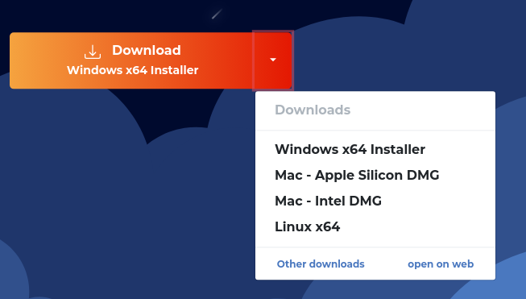

# Phoenix Code Setup Guide

## Introduction

Phoenix Code is a text editor designed to make coding as intuitive and fun as playing a video game - specially crafted for web developers, designers, and students. This guide provides step-by-step instructions on how to download, install, and start using Phoenix Code on your system.

## Step 1: Downloading Phoenix Code

Visit the official website - [phcode.io](https://phcode.io) and click the download button to download the apropriate app installer for your operating system.


NB: Linux users, please see below section `How to Install on Linux`

### Choosing a Custom Installer

If you need a version for a different operating system or have specific requirements:

1. Click on the **"Download"** drop-down menu on the website.
2. Select the desired installer from the available options.



Phoenix Code is compatible with a wide range of operating systems, including:

- **Mac**: M1 and Intel chipsets
- **Windows**: x64 architectures
- **Linux**: Ubuntu, Pop!_OS, Fedora, Arch, and more

## Step 2: Installing Phoenix Code

Run the downloaded installer(in Windows and Mac) and follow the on-screen instructions to install Phoenix Code on your device.

### How to Install on Linux


1. Open the Terminal. You can usually find the Terminal in your applications menu.
1. Copy the command from the website or use the command:
```bash
wget -qO- https://updates.phcode.io/linux/installer.sh | bash
```


## Using the Web Version

If you prefer not to install any software, you can use the web version of Phoenix Code by visiting [https://phcode.dev](https://phcode.dev). This version allows you to use Phoenix Code directly in your browser.

## Getting Started

With Phoenix Code now installed or accessed through the web, you are ready to dive into your coding and web design projects.
