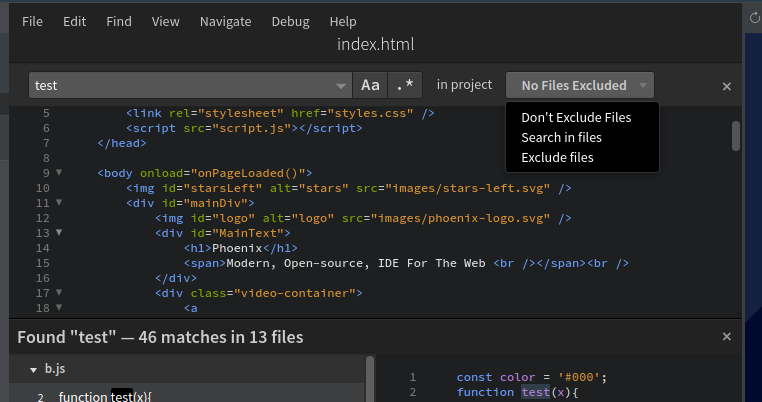
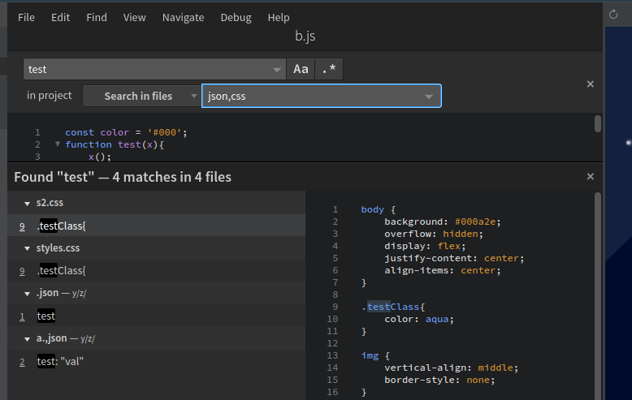

# Find In Files

The Find in Files feature in Phoenix Code is a powerful tool to quickly search for specific text across multiple files within a project. This feature is useful for developers working on large codebases to find references, variable names, or specific lines of code.

To search across your project files, use `Ctrl-Shift-F` on Windows/Linux or `Cmd-Shift-F` on Mac, or select `Find > Find in Files` from the menu. This feature searches for your term throughout the project's files and displays each occurrence with its file name, line number, and a snippet of the code for context.


## Searching Within a Folder

To search within a specific folder in Phoenix:

1. Right-click on the folder in the Files panel where you want to perform the search.
1. From the context menu that appears, select "Find in...".
  
  

3. The find bar will now appear with search restricted to that folder (See `in y/` in the below image).
 
  

## Using File Filters

By default, Find in Files searches all files in your project folder. You can exclude or include files, file types, whole folders, or other patterns:

* Click the "No Files Excluded" dropdown from the search bar.

  

Phoenix Code allows you to specify which files and folders should be excluded or included during project searches.

### For searching only within files matching pattern

When you select `Search in files` option from the above dropdown, the filter will search only within files and folders that match the entered patterns. Entering `*.json,*.css` will include only JSON and css files in your search results, or just enter `json` to select any files having charecters `json` in its path. See more patterns below.



### For Excluding files

When you select `Exclude files` option from the above dropdown, the filter will ignore files and folders that match the patterns you enter. For instance, typing `*.json` in the text area will exclude all JSON files from your search results. See more patterns below.

## The filter pattern

This section describes the format of the exclusion/search within files glob pattern.

1. Each pattern should be entered as a comma seperated text. You can specify multiple patterns:
   ```txt
   *.js,*.json
   ```
1. To fuzzy search, just enter text. Eg. entering `css` will match all filenames that has the letters `css` in its path name like `x/st.css` and `cssFile.md`.
1. To match all JavaScript files in any directory, use `*.js`. This matches files like `a/b/x.js` and `xyz.js`.
1. To match JavaScript files only in the project root, use `./*.js`. This matches `x.js` in the root but not `y/x.js` in a subdirectory.
1. To match css files only in a folder `search/folder`, use `search/folder/*.css`. This matches `search/folder/x.css` but not `y/x.css`.
1. `?.js` will match only `a/b/x.js` and not `xyx.js`
1. `**/some_folder/**` will match `some_folder` anywhere.
1. `[]` to declare a range of characters to match (`example.[0-9]` to match on `example.0`, `example.1`, …)
1. To search for files names with `,` in it, use escape char `\`. Eg. To match a file with name `hello,world.js`, the filter string to use is `hello\,world.js`.
1. More complex glob patterns can be provided. See: https://www.malikbrowne.com/blog/a-beginners-guide-glob-patterns/
